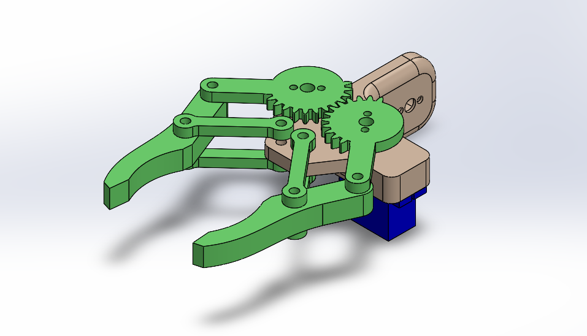

# 5DOF-Robot-Arm

# Table of Contents

1. [Overview](#overview)
2. [Methods](#methods)
   - [Components](#components)
   - [Assembly](#assembly)
     - [Gripper](#gripper)
     - [Robot Arm](#robot-arm)
3. [Output](#output)

---

## Overview

This is Task One in the Mechanical Engineering track, submitted to Smart Methods Company for the 2025 Summer Internship. This task presents a 5-degree-of-freedom (DOF) robotic arm designed using SolidWorks. The design also integrates the necessary motors to assemble the model, making it close to real life.

---

## Methods

The main software used is SolidWorks to design and assemble individual parts. The model consists of a 4-DOF robotic arm plus a gripper (1 DOF); thus, the total of the whole system is 5-DOF.

### Components

The model consists of 9 parts and 2 motors. However, some parts are repeated in the assembly stage as shown in the table below:

| Component                           | Quantity |
|-------------------------------------|----------|
| Base                                | 1        |
| Waist                               | 1        |
| Shoulder                            | 1        |
| Elbow                               | 1        |
| Wrist                               | 1        |
| Gripper Base                        | 1        |
| Gripper Link                        | 4        |
| Gripper Finger                      | 2        |
| Gear                                | 2        |
| MG996R Servo Motor                  | 3        |
| SG90R Micro Servo Motor             | 3        |

### Assembly

In the assembly stage, the gripper is assembled as an isolated system and then grouped into the whole system.

#### Gripper

- Attach SG90R servo motor to the gripper base.
- Add 2 gears to the gripper base, concentrating on the holes of both gripper base and gears. These holes are to be filled with screws and nuts if the model is printed.
- Insert 4 links to the system; these links are to be connected with the base and the gripper fingers through the screws.
- Finally, assemble 2 gripper fingers with the system to form the gripper as a sub-system.

#### Robot Arm

- Attach 3 separate MG996R servo motors to the robot base, waist, and elbow.
- Attach 2 separate SG90R servo motors to the elbow and wrist.
- Join the waist with the base above each other respectively.
- Add the shoulder to the previous parts with one side only (left or right).
- Insert the elbow with the shoulder by one side (left or right).
- From front, connect the wrist with the system.
- Finally, assemble the gripper system with the robot system to form the whole system.

**Note:** The model files are attached as separate files in the repository of two different format files: SOLIDWORKS Assembly Document and STL.

---

## Output

  
   
  <em>Figure 1: Gripper Assembly</em>

  
   
  <em>Figure 2: Robot Arm Assembly</em>

As shown in the previous figures, the final assembly should look similar to them. The motion is generated as follows:

 1. **1st DOF:** Waist rotation around the origin.
 2. **2nd DOF:** Shoulder moves back and forth in rotational movement.
 3. **3rd DOF:** Elbow stands up & down also rotationally.
 4. **4th DOF:** Wrist rotation around the center of the elbow.
 5. **5th DOF:** Gripper movement right and left in rotational form.

Regardless of the appearance of the robotic arm, there are some misalignments in the interfaces and clearances between parts, which may cause high friction. However, this is only an introduction to the world of robot design, leaving significant room for improvement in future tasks.
